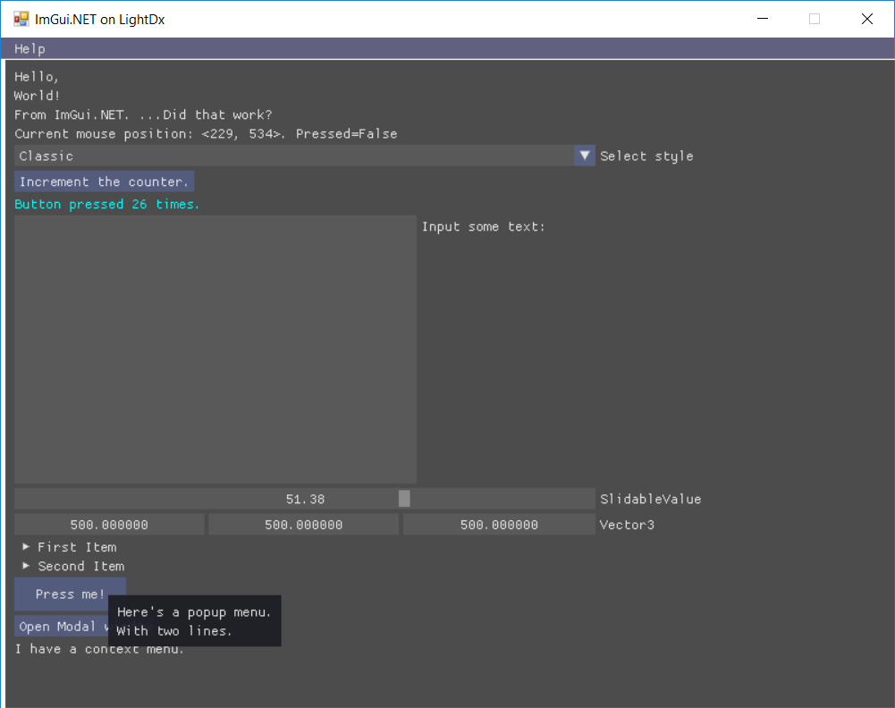

# ImGui On LightDx

This is the [ImGui.NET](https://github.com/mellinoe/ImGui.NET) sample program, but with backend ported from OpenTK to [LightDx](https://github.com/acaly/LightDX),
just to check the functionality of LightDx library.

# Screenshots

